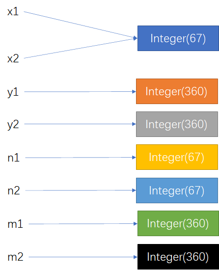

# 关于Integer的自动装箱与自动拆箱

Integer x1 = 36和Integer n1 = new Integer(36)有什么区别呢？我们尝试运行下面代码看看会是什么结果：

```java
public class Int {
    public static void main(String[] args) {
        Integer x1 = 36;
        Integer x2 = 36;
        boolean r1 = x1==x2;
        System.out.println("x1==x2:" + r1);

        Integer y1 = 360;
        Integer y2 = 360;
        boolean r2 = y1==y2;
        System.out.println("y1==y2:" + r2);

        Integer n1 = new Integer(36);
        Integer n2 = new Integer(36);
        boolean r3 = n1==n2;
        System.out.println("n1==n2:" + r3);

        Integer m1 = new Integer(360);
        Integer m2 = new Integer(360);
        boolean r4 = m1==m2;
        System.out.println("m1==m2:" + r4);
    }
}
```

运行结果：

```
x1==x2:true
y1==y2:false
n1==n2:false
m1==m2:false
```

看到运行结果是不是感觉有些奇怪，y1==y、n1==n2、m1==m2为什么结果是false？我们对代码进行反编译，反编译后代码如下：

```java
public class Int {
    public static void main(String[] args) {
        Integer x1 = Integer.valueOf(36);
        Integer x2 = Integer.valueOf(36);
        boolean r1 = (x1 == x2);
        System.out.println("x1==x2:" + r1);
        
        Integer y1 = Integer.valueOf(360);
        Integer y2 = Integer.valueOf(360);
        boolean r2 = (y1 == y2);
        System.out.println("y1==y2:" + r2);
        
        Integer n1 = new Integer(36);
        Integer n2 = new Integer(36);
        boolean r3 = (n1 == n2);
        System.out.println("n1==n2:" + r3);
        
        Integer m1 = new Integer(360);
        Integer m2 = new Integer(360);
        boolean r4 = (m1 == m2);
        System.out.println("m1==m2:" + r4);
    }
}
```

从反编译结果来看，Integer x1 = 36和Integer n1 = new Integer(36)分别调用了Integer.valueOf(int i)和Integer(int value)方法。Integer.valueOf(int i)和Integer(int value)源码如下：

```java
public Integer(int value) {
    this.value = value;
}

public static Integer valueOf(int i) {
    if (i >= IntegerCache.low && i <= IntegerCache.high)
        return IntegerCache.cache[i + (-IntegerCache.low)];
    return new Integer(i);
}

private static class IntegerCache {
    static final int low = -128;
    static final int high;
    static final Integer cache[];

    static {
        // high value may be configured by property
        int h = 127;
        String integerCacheHighPropValue =
            sun.misc.VM.getSavedProperty("java.lang.Integer.IntegerCache.high");
        if (integerCacheHighPropValue != null) {
            try {
                int i = parseInt(integerCacheHighPropValue);
                i = Math.max(i, 127);
                // Maximum array size is Integer.MAX_VALUE
                h = Math.min(i, Integer.MAX_VALUE - (-low) -1);
            } catch( NumberFormatException nfe) {
                    // If the property cannot be parsed into an int, ignore it.
            }
        }
        high = h;

        cache = new Integer[(high - low) + 1];
        int j = low;
        for(int k = 0; k < cache.length; k++)
            cache[k] = new Integer(j++);

          // range [-128, 127] must be interned (JLS7 5.1.7)
          assert IntegerCache.high >= 127;
    }

    private IntegerCache() {}
}
```

Integer是int类型的包装类，当int值赋值给Integer时会使用valueOf(int i)方法自动装箱。从源码可以看出，默认情况下cache[]缓存范围是[-128,127]。对于valueOf(int i)，当i在[-128,127]内，则直接返回catch中缓存的Integer对象，所以，x1，x2其实指向了同一个Integer对象。当i在[-128,127]外，则会重新new一个Integer对象并且返回，所以y1，y2其实是指向了不同的Integer对象。new Integer(36)和new Integer(360)调用Integer构造函数，得到的是不同的Integer对象。由此可见它们的不同之处是：x1、x2指向了同一个Integer对象，y1、y2、n1、n2、m1、m2各指向不同的Integer对象。对于对象引用类型：“==”比较的是对象的内存地址，对于基本数据类型比较的是数值。所以x1==x2结果为true，y1==y、n1==n2、m1==m2结果为false。



我们在运行一下下面代码：

Unpacking.java

```java
public class Unpacking {
    public static void main(String[] args) {
        int a = 10;
        Integer b = 10;
        boolean result = a == b;
        System.out.println(result);
    }
}
```

运行结果：

```
true
```

我们对代码进行反编译，反编译后代码如下：

```java
public class Unpacking {
    public static void main(String[] args) {
        int a = 10;
        Integer b = Integer.valueOf(10);
        boolean result = (a == b.intValue());
        System.out.println(result);
    }
}


/**
 * Returns the value of this {@code Integer} as an
 * {@code int}.
 */
public int intValue() {
    return value;
}
```

我们看到a、b在比较的时候，b调用了intValue()方法，获取了对象b的value值。这里b调用了intValue()方法进行自动拆箱，将自己的value值与a作比较，结果为true。到这里我们就应该知道，Integer的自动装箱是使用valueOf(int i)方法，自动拆箱是使用intValue()方法。


前面提到：对于对象引用类型：“==”比较的是对象的内存地址，对于基本数据类型比较的是数值。我们可以通过字节码来证明这一点：

Int.class

    //Integer x1 = 36;
    //Integer x2 = 36;
    //boolean r1 = x1==x2;
    //System.out.println("x1==x2:" + r1);
    
    0: bipush        36
    2: invokestatic  #2                  // Method java/lang/Integer.valueOf:(I)Ljava/lang/Integer;
    5: astore_1
    6: bipush        36
    8: invokestatic  #2                  // Method java/lang/Integer.valueOf:(I)Ljava/lang/Integer;
    11: astore_2
    12: aload_1
    13: aload_2
    14: if_acmpne     21
    17: iconst_1
    18: goto          22
    21: iconst_0
    22: istore_3
在Int类中x1、x2为引用类型。x1==x2比较使用到的是if_acmpne指令，其中a代表 reference的地址(address)，是两个引用的比较。

Test.java

```java
public class Test {
    public static void main(String[] args) {
        int a = 3;
        int b = 4;
        boolean result = a == b;
        System.out.println(result);
    }
}
```

Test.class

```
//int a = 3;
//int b = 4;
//boolean result = a == b;

0: iconst_3
1: istore_1
2: iconst_4
3: istore_2
4: iload_1
5: iload_2
6: if_icmpne     13
9: iconst_1
10: goto          14
13: iconst_0
14: istore_3
```

在Test类中x1、x2为基本数据类型。x1==x2比较使用到的是if_icmpne指令，其中i 代表对 int，是两个数值的比较。所以，对于对象引用类型：“==”比较的是对象的内存地址，对于基本数据类型比较的是数值的结论是对的。


当我们比较两个Integer，想让它们的value相等就返回true时，我们可以使用Integer的equals方法，方法源码如下：

```java
/**
 * Compares this object to the specified object.  The result is
 * {@code true} if and only if the argument is not
 * {@code null} and is an {@code Integer} object that
 * contains the same {@code int} value as this object.
 *
 * @param   obj   the object to compare with.
 * @return  {@code true} if the objects are the same;
 *          {@code false} otherwise.
 */
public boolean equals(Object obj) {
    if (obj instanceof Integer) {
        return value == ((Integer)obj).intValue();
    }
    return false;
}

public int intValue() {
    return value;
}
```


> Java虚拟机指令集《Java Virtual Machine Specification》[Chapter 6. The Java Virtual Machine Instruction Set](https://docs.oracle.com/javase/specs/jvms/se8/html/jvms-6.html)

