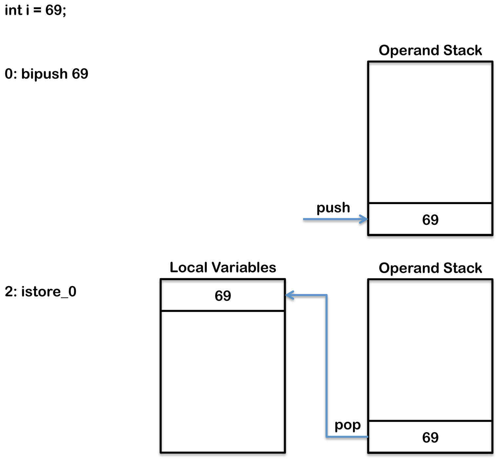

# Java Code To Byte Code - Part One

Understanding how Java code is compiled into byte code and executed on a Java Virtual Machine (JVM) is critical because it helps you understand what is happening as your program executes. This understanding not only ensures that language features make logical sense **~~but also that it is possible to understand the trade offs and side effects when making certain discussions.~~** This article explains how Java code is compiled into byte code and executed on the JVM. To understand the internal architecture in the JVM and different memory areas used during byte code execution see my previous article on [JVM Internals](https://blog.jamesdbloom.com/JVMInternals.html).

# Java代码到字节码-第一部分

理解Java代码是如何编译成字节码并在Java虚拟机(JVM)上执行的是至关重要的，因为这有助于理解程序执行时发生了什么。这种理解不仅确保了语言特性具有逻辑意义，而且还可以在进行某些讨论时理解权衡和副作用。本文解释了Java代码是如何编译成字节代码并在JVM上执行的。要了解JVM的内部架构和字节码执行期间使用的不同内存区域，请参阅我关于JVM内部的前一篇文章 [JVM Internals](https://blog.jamesdbloom.com/JVMInternals.html)。

This article is split into three parts, with each part being subdivided into sections. It is possible to read each section in isolation however the concepts will generally build up so it is easiest to read the sections. Each section will cover different Java code structures and explain how these are compiled and executed as byte code, as follows:

- Part 1 - Basic Programming Concepts

  - variables
    - [local variables](https://blog.jamesdbloom.com/JavaCodeToByteCode_PartOne.html#local_variables)
    - [fields (`class` variables)](https://blog.jamesdbloom.com/JavaCodeToByteCode_PartOne.html#fields)
    - [constant fields (`class` constants)](https://blog.jamesdbloom.com/JavaCodeToByteCode_PartOne.html#constant_fields)
    - [`static` variables](https://blog.jamesdbloom.com/JavaCodeToByteCode_PartOne.html#static_variables)
  - conditionals
    - [`if`-`else`](https://blog.jamesdbloom.com/JavaCodeToByteCode_PartOne.html#if_else)
    - [`switch`](https://blog.jamesdbloom.com/JavaCodeToByteCode_PartOne.html#switch)
  - loops
    - [`while`-loop](https://blog.jamesdbloom.com/JavaCodeToByteCode_PartOne.html#while_loop)
    - [`for`-loop](https://blog.jamesdbloom.com/JavaCodeToByteCode_PartOne.html#for_loop)
    - [`do`-`while`-loop](https://blog.jamesdbloom.com/JavaCodeToByteCode_PartOne.html#do_while_loop)

- Part 2 - Object Orientation And Safety(next article)

  - try-catch-finally

  - synchronized
  - method invocation
  - new (objects and arrays)

- Part 3 - Metaprogramming(future article)

  - generics
  - annotations
  - reflection

本文分为三个部分，每个部分又分成几个小节。可以单独阅读每个部分，但是概念通常会逐渐形成，所以阅读各个部分是最容易的。每一节都将介绍不同的Java代码结构，并解释这些代码是如何作为字节码编译和执行的，如下所示:

- 第1部分-基本编程概念

  - 变量
    - 本地变量
    - 字段(类变量)
    - 常量字段 (类常量)
    - 静态变量
  - 条件语句
    - if-else
    - switch
  - 循环语句
    - while-loop
    - for-loop
    - do-while-loop

- 第2部分—面向对象和安全(下一篇)

  - try-catch-finally

  - synchronized
  - 方法调用
  - new (objects and arrays)

- 第3部分—元编程(以后的文章)

  - generics
  - annotations
  - reflection

This article includes many code example and shows the corresponding typical byte code that is generated. The numbers that precede each instruction (or opcode) in the byte code indicates the byte position. For example an instruction such a 1: iconst_1 is only one byte in length, as there is no operand, so the following byte code would be at 2. An instruction such as 1: bipush *5* would take two bytes, one byte for the opcode bipush and one byte for the operand *5*. In this case the following byte code would be at 3 as the operand occupied the byte at position 2.

本文包含了许多代码示例，并展示了生成的相应的典型字节码。字节码中每个指令(或操作码)前面的数字表示字节的位置。例如，像1:iconst_1这样的指令只有一个字节长度，因为没有操作数，所以下面的字节码将位于2。像1:bipush 5这样的指令将占用两个字节，一个字节用于操作码bipush，一个字节用于操作数5。在这种情况下，当操作数占用位置2的字节时，下面的字节代码将位于3。

## Variables

### Local Variables

The Java Virtual Machine (JVM) has a stack based architecture. When each method is executed including the initial main method a frame is created on the stack which has a set of local variables. The array of local variables contains all the variables used during the execution of the method, including a reference to this, all method parameters, and other locally defined variables. For class methods (i.e. static methods) the method parameters start from zero, however, for instance methods the zero slot is reserved for this.

A local variable can be:

- boolean
- byte
- char
- long
- short
- int
- float
- double
- reference
- returnAddress

All types take a single slot in the local variable array except long and double which both take two consecutive slots because these types are double width (64-bit instead of 32-bit).

## 变量

### 本地变量

Java虚拟机(JVM)有一个基于堆栈的体系结构。当每个方法(包括初始的主方法)被执行时，堆栈上就会创建一个包含一组局部变量的框架。局部变量数组包含方法执行期间使用的所有变量，包括对this的引用、所有方法参数和其他局部定义的变量。对于类方法(即静态方法)，方法参数从0开始，然而，对于实例方法，0槽是为this保留的。

局部变量可以是:

- boolean
- byte
- char
- long
- short
- int
- float
- double
- reference
- returnAddress

所有类型都在局部变量数组中占用一个单独的槽位，除了long和double，它们都占用两个连续的槽位，因为这些类型占用64位而不是32位。

When a new variable is created the operand stack is used to store the value of the new variable. The value of the new variable is then stored into the local variables array in the correct slot. If the variable is not a primitive value then the local variable slot only stores a reference. The reference points to an the object stored in the heap.

创建新变量时，使用操作数堆栈存储新变量的值。然后，新变量的值被存储到正确槽中的本地变量数组中。如果变量不是原语值，则局部变量slot只存储引用。引用指向存储在堆中的对象。

For example:

```java
int i = 5;
```

Is compile to:

```java
0: bipush      5
2: istore_0
```

bipush              	    Is used to add a byte as an integer to the operand stack, in this case 5 as added to the operand stack.

istore_0					Is one of a group of opcodes with the format istore_<n> they all store an integer into local variables. The <n> refers to the location in 								  the local variable array that is being stored and can only be 0, 1, 2 or 3. Another opcode is used for values higher then 3 called istore, 								  which takes an operand for the location in the local variable array.

In memory when this is executed the following happens:

例如：

```java
int i = 5;
```

编译后是：

```java
0: bipush 5
2: istore_0
```

bipush：用于将一个字节作为整数添加到操作数堆栈，在本例中添加到操作数栈的值为5。

istore_0：是一组操作码，格式为istore_<n>，它们将一个整数存储到局部变量中。<n>指的是正在存储的本地变量数组中的位置，只能是0、1、2或3。另一个操作码用于大于3的值，称为istore，它接受局部变量数组中位置的操作数。

在内存中，当执行此命令时，会发生以下情况:



The class file also contains a local variable table for each method, if this code was included in a method you would get the following entry in the local variable table for that method in the class file.

类文件还包含每个方法的局部变量表，如果该代码包含在一个方法中，您将在类文件中该方法的局部变量表中获得以下条目。

```java
LocalVariableTable:
        Start  Length  Slot  Name   Signature
          0      1      1     i         I
```

### Fields (Class Variables)

A field (or class variable) is stored on the heap as part of a class instance (or object). Information about the field is added into the **field_info** array in the class file as shown below.

### 字段(类变量)

字段(或类变量)作为类实例(或对象)的一部分存储在堆上。关于该字段的信息被添加到类文件中的 **field_info** 数组中，如下所示。

```
ClassFile {
    u4			magic;
    u2			minor_version;
    u2			major_version;
    u2			constant_pool_count;
    cp_info		contant_pool[constant_pool_count – 1];
    u2			access_flags;
    u2			this_class;
    u2			super_class;
    u2			interfaces_count;
    u2			interfaces[interfaces_count];
    u2			fields_count;
    field_info		fields[fields_count];
    u2			methods_count;
    method_info		methods[methods_count];
    u2			attributes_count;
    attribute_info	attributes[attributes_count];
}
```

In addition if the variable is initialized the byte code to do the initialization is added into the constructor.

When the following java code is compiled:

另外，如果变量被初始化，进行初始化的字节码将被添加到构造函数中。编译以下java代码时:

```java
public class SimpleClass {

    public int simpleField = 100;

}
```

An extra section appears when you run javap demonstrating the field added to the field_info array:

当你运行javap演示添加到 field_info 数组的字段时，会出现一个额外的部分:

```java
public int simpleField;
    Signature: I
    flags: ACC_PUBLIC
```

The byte code for the initialization is added into the constructor (shown in bold), as follows:

初始化的字节码被添加到构造函数中(4,5,7)，如下所示:

```java
public SimpleClass();
  Signature: ()V
  flags: ACC_PUBLIC
  Code:
    stack=2, locals=1, args_size=1
       0: aload_0
       1: invokespecial #1                  // Method java/lang/Object."<init>":()V
       4: aload_0
       5: bipush        100
       7: putfield      #2                  // Field simpleField:I
      10: return
```

aload_0

Loads the an object reference from the local variable array slot onto the top of the operand stack. Although the code shown has no constructor the initialization code for class variables (field) actually executed in the default constructor created by the compiler. As a result the first local variable actually points to this, therefore the aload_0 opcode loads the this reference onto the operand stack. aload_0 is one of a group of opcodes with the format aload_<n> they all load an object reference into the operand stack. The <n> refers to the location in the local variable array that is being accessed but can only be 0, 1, 2 or 3. There are other similar opcodes for loading values that are not an object reference iload_<n>, lload_<n>, fload_<n> and dload_<n> where i is for int, l is for long, f is for float and d is for double. Local variables with an index higher than 3 can be loaded using iload, lload, fload, dload and aload these opcodes all take a single operand that specifies the index of local variable to load.

aload_0

将对象引用从局部变量数组槽加载到操作数堆栈的顶部。虽然显示的代码没有构造函数，但类变量(字段)的初始化代码实际上在编译器创建的默认构造函数中执行。因此，第一个局部变量实际上指向this，因此aload_0操作码将this引用加载到操作数堆栈中。aload_0是一组操作码之一，格式为aload&lt;n&gt;，它们都将对象引用加载到操作数堆栈中。&lt;n&gt;指正在访问的局部变量数组中的位置，但只能为0、1、2或3。还有其他类似的操作码用于加载非对象引用的值 iload&lt;n&gt;， lload&lt;n&gt;， fload&lt;n&gt;和dload_&lt; n&gt;I代表int, l代表long, f代表float, d代表double。可以使用ilload、lload、load、dload和load加载索引大于3的局部变量，这些操作码都接受一个操作数，该操作数指定要加载的局部变量的索引。

invokespecial

The invokespecial instruction is used to invoke instance initialization methods as well as private methods and methods of a superclass of the current class. It is part of a group of opcodes that invoke methods in different ways that include invokedynamic, invokeinterface, invokespecial, invokestatic, invokevirtual. The invokespecial instruction is this code is invoking the superclass constructor i.e. the constructor of java.lang.Object.

invokespecial

invokspecial指令用于调用实例初始化方法以及当前类的私有方法和超类的方法。它是一组操作码的一部分，这些操作码以不同的方式调用方法，包括invokedynamic、invokeinterface、invokspecial、invokestatic、invokvirtual。invokspecial指令是这段代码正在调用超类构造函数，也就是java.lang.Object的构造函数。

bipush

Is used to add a byte as an integer to the operand stack, in this case 5 as added to the operand stack.

bipush

用于将一个字节作为整数添加到操作数堆栈，在本例中为5添加到操作数堆栈。

putfield

Takes a single operand that references a field in the run time constant pool, in this case the field called simpleField. The value to set the field to and the object that contains the field are both popped off the operand stack. The aload_0 previously added the object that contains the field and the bipush previously added the 100 to the operand stack. The putfield then removes (pops) both of these values from the operand stack. The final result is that the field simpleField on the this object is updated with the value 100.

In memory when this is executed the following happens:

putfield

生成单个操作数，该操作数引用运行时常量池中的一个字段，在本例中是名为simpleField的字段。设置该字段的值和包含该字段的对象都将从操作数堆栈中弹出。aload_0先前添加了包含字段的对象，而bipush先前将100添加到操作数堆栈。putfield然后从操作数堆栈中移除(pop)这两个值。最终的结果是该对象上的字段simpleField被更新为值100。

在内存中，当执行此命令时，会发生以下情况:


The putfield opcode has a single operand that referencing the second position in the constant pool. The JVM maintains a per-type constant pool, a run time data structure that is similar to a symbol table although it contains more data. Byte codes in Java require data, often this data is too large to store directly in the byte codes, instead it is stored in the constant pool and the byte code contains a reference to the constant pool. When a class file is created it has a section for the constant pool as follows:

putfield操作码有一个操作数，该操作数引用常量池中的第二个位置。JVM维护每个类型的常量池，这是一种运行时数据结构，类似于符号表，但它包含更多的数据。Java中的字节码需要数据，通常这些数据太大而不能直接存储在字节码中，相反，它被存储在常量池中，字节码包含对常量池的引用。当创建一个类文件时，它有一个常量池的部分，如下所示:

```java
Constant pool:
   #1 = Methodref          #4.#16         //  java/lang/Object."<init>":()V
   #2 = Fieldref           #3.#17         //  SimpleClass.simpleField:I
   #3 = Class              #13            //  SimpleClass
   #4 = Class              #19            //  java/lang/Object
   #5 = Utf8               simpleField
   #6 = Utf8               I
   #7 = Utf8               <init>
   #8 = Utf8               ()V
   #9 = Utf8               Code
  #10 = Utf8               LineNumberTable
  #11 = Utf8               LocalVariableTable
  #12 = Utf8               this
  #13 = Utf8               SimpleClass
  #14 = Utf8               SourceFile
  #15 = Utf8               SimpleClass.java
  #16 = NameAndType        #7:#8          //  "<init>":()V
  #17 = NameAndType        #5:#6          //  simpleField:I
  #18 = Utf8               LSimpleClass;
  #19 = Utf8               java/lang/Object
```

### Constants Fields (Class Constants)

A constant field with the final modifier is flagged as *ACC_FINAL* in the class file.

For example:

### 常量字段 (类常量)

带有 **final** 修饰符的常量字段在类文件中被标记为 **ACC_FINAL**。

例如：

```
public class SimpleClass {

    public final int simpleField = 100;
    
}
```

The field description is augmented with *ACC_FINAL*:

字段描述用ACC_FINAL增强：

```
public static final int simpleField = 100;
    Signature: I
    flags: ACC_PUBLIC, ACC_FINAL
    ConstantValue: int 100
```

The initialization in the constructor is however unaffected:

构造函数中的初始化是不受影响的：

```
4: aload_0
5: bipush        100
7: putfield      #2                  // Field simpleField:I
```

## Conditionals

Conditional flow control, such as, if-else statements and switch statements work by using an instruction that compares two values and branches to another byte code.

Loops including for-loops and while-loops work in a similar way except that they typically also include a goto instructions that causes the byte code to loop. do-while-loops do not require any goto instruction because their conditional branch is at the end of the byte code. For more detail on loops see the [loops section](https://blog.jamesdbloom.com/JavaCodeToByteCode_PartOne.html#loops).

Some opcodes can compare two integers or two references and then preform a branch in a single instruction. Comparisons between other types such as doubles, longs or floats is a two-step process. First the comparison is performed and 1, 0 or -1 is pushed onto the operand stack. Next a branch is performed based on whether the value on the operand stack is greater, less-than or equal to zero.

First the if-else statement will be explained as an example and then the different types of instructions used for branching will be [covered in more detail](https://blog.jamesdbloom.com/JavaCodeToByteCode_PartOne.html#instructions_for_branching).

## 条件语句

条件流控制，例如if-else语句和switch语句，通过使用比较两个值并分支到另一个字节码的指令来工作。

包括for-loop和while-loop的循环以类似的方式工作，除了它们通常还包括导致字节码循环的goto指令。do-while-循环不需要任何goto指令，因为它们的条件分支位于字节码的末尾。有关循环的更多细节，请参阅循环部分。

有些操作码可以比较两个整数或两个引用，然后在单个指令中执行一个分支。在其他类型(如double、long或float)之间进行比较需要两个步骤。首先执行比较，将1、0或-1压入操作数堆栈。接下来，根据操作数堆栈上的值是大于、小于还是等于零来执行分支。

首先，if-else语句将被解释为一个例子，然后将更详细地介绍用于分支的不同类型的指令。

### if-else

The following code example shows a simple if-else comparing two integer parameters.

下面的代码示例显示了一个比较两个整型参数的简单if-else。

```
public int greaterThen(int intOne, int intTwo) {
    if (intOne > intTwo) {
        return 0;
    } else {
        return 1;
    }
}
```

This method results in the following byte code:

这个方法会产生以下字节码:

```
0: iload_1
1: iload_2
2: if_icmple     7
5: iconst_0
6: ireturn
7: iconst_1
8: ireturn
```

First the two parameters are loaded onto the operand stack using iload_1 and iload_2. if_icmple then compares the top two values on the operand stack. This operand branches to byte code 7 if intOne is less then or equal to intTwo. Notice this is the exact opposite of the test in the if condition in the Java code because if the byte code test is successful execution branches to the else-block where as in the Java code if the test is successful the execution enters the if-block. In other words if_icmple is testing if the if condition is not true and jumping over the if-block. The body of the if-block is byte code 5 and 6, the body of the else-block is byte code 7 and 8.

首先，使用iload_1和iload_2将两个参数加载到操作数堆栈上。if_icmple然后比较操作数堆栈上的前两个值。如果intOne小于或等于intTwo，则该操作数分支到字节码7。注意，这与Java代码中的if条件中的测试完全相反，因为如果字节码测试成功，则执行分支到else-块，而在Java代码中，如果测试成功，则执行进入if-块。换句话说，if_icmple正在测试if条件是否为真并跳过if块。if-block的主体是字节码5和6,else-block的主体是字节码7和8。


The following code example shows a slightly more complex example which requires a two-step comparison.

下面的代码示例显示了一个稍微复杂一些的示例，它需要两步比较。

```
public int greaterThen(float floatOne, float floatTwo) {
    int result;
    if (floatOne > floatTwo) {
        result = 1;
    } else {
        result = 2;
    }
    return result;
}
```

This method results in the following byte code:

这个方法会产生以下字节码:

```
 0: fload_1
 1: fload_2
 2: fcmpl
 3: ifle          11
 6: iconst_1
 7: istore_3
 8: goto          13
11: iconst_2
12: istore_3
13: iload_3
14: ireturn
```

In this example first the two parameters values are pushed onto the operand stack using fload_1 and fload_2. This example is different from the previous example because of the two-step comparison. fcmpl is first used to compare floatOne and floatTwo and push the result onto the operand stack as follows:

在本例中，首先使用fload_1和fload_2将两个参数值压入操作数堆栈。这个示例与上一个示例的不同之处在于两步比较。fcmpl首先用于比较floatOne和floatTwo，并将结果压入操作数堆栈，如下所示:

- floatOne **>** floatTwo **–> 1**
- floatOne **=** floatTwo **–> 0**
- floatOne **<** floatTwo **–> -1**
- floatOne or floatTwo = NaN **–> 1**

Next ifle is used to branch to byte code 11 if the result from fcmpl is <= 0.

如果fcmpl的结果<= 0，则使用下一个ifle分支到字节码11。

This example is also different from the previous example in that there is only a single return statement at the end of the method as a result a goto is required at the end of the if-block to prevent the else-block from also being executed. The goto branches to byte code 13 where iload_3 is then used to push the result stored in the third local variable slot to the top of the operand stack so that it can be returned by the return instruction.

这个示例与上一个示例的不同之处在于，方法末尾只有一条return语句，因此if-block末尾需要goto语句，以防止else-block也被执行。goto分支到字节码13，然后使用iload_3将存储在第三个局部变量槽中的结果推到操作数堆栈的顶部，以便它可以由返回指令返回。


As well as comparing numeric values there are comparison opcodes for reference equality i.e. ==, for comparison to null i.e. == null and != null and for testing an object's type i.e. instanceof.

除了数字值的比较，还有引用相等的比较操作码，如==，null的比较操作码，如== null和!= null，以及测试对象的类型，如instanceof。


**if_icmp<cond>**        cond: eq\ne\lt\le\gt\ge

This group of opcodes are used to compare the top two integers on the operand stack and branch to a new byte code. The **<cond>** can be:

这组操作码用于比较操作数堆栈上的前两个整数，并分支到新的字节码。<cond>可以是:

- eq - equals                                    ==
- ne - not equals                             !=
- lt - less then                                  <
- le - less then or equal                 <=
- gt - greater then                           >             
- ge - greater then or equal          >=

**if_acmp<cond>**        cond: eq\ne

These two opcodes are used to test if two references are eq equal or ne non equal and branch to a new byte code location as specified by the operand.

这两个操作码用于测试两个引用是eq相等还是ne不相等，并转移到由操作数指定的新字节码位置。

**ifnonnull、ifnull**

These two opcodes are used to test if two references are null or not null and branch to a new byte code location as specified by the operand.

这两个操作码用于测试两个引用是否为空，并转移到由操作数指定的新字节码位置。

**lcmp**

This opcode is used to compare the top two integers on the operand stack and push a value onto the operand stack as follows:

这个操作码用于比较操作数堆栈上的前两个整数，并将一个值压入操作数堆栈，如下所示:

- if value1 > value2 –> push 1
- if value1 = value2 –> push 0
- if value1 < value2 –> push -1

**fcmp<cond>**    cond:  l\g

This group of opcodes is used to compare two float or double values and push a value onto the operand stack as follows:

这组操作码用于比较两个浮点值或双精度值，并将一个值压入操作数堆栈，如下所示:

- if value1 > value2 –> push 1
- if value1 = value2 –> push 0
- if value1 < value2 –> push -1

**dcmp<cond>**    cond: l\g

The difference between the two types of operand ending in l or g is how they handle NaN. The fcmpg and dcmpg instructions push the int value 1 onto the operand stack whereas fcmpl and dcmpl push -1 onto the operand stack. This ensures that when testing two values if either of them are Not A Number (NaN) then the test will not be successful. For example if testing if x > y (where x and y are doubles) then fcmpl is used so that if either value is NaN the into value -1 is pushed onto the operand stack. The next opcode will always be a ifle instruction which branches if the value is less then 0. **~~As a result if either x or y was a NaN the ifle would branch over the if-block preventing the code in the if-block from being executed.~~**

以l或g结尾的两种操作数之间的区别在于它们如何处理NaN。fcmpg和dcmpg指令将int值1压入操作数堆栈，而fcmpl和dcmpl将-1压入操作数堆栈。这确保了在测试两个值时，如果其中任何一个值不是一个数字(NaN)，那么测试将不会成功。例如，if测试if x &gt;y(其中x和y是双精度的)然后使用fcmpl，这样如果任何一个值是NaN, into值-1就会压入操作数堆栈。下一个操作码将始终是一个ifle指令，如果值小于0则进行分支。因此，如果x或y是NaN, ifle将分支到if块上，阻止if块中的代码被执行。

**instanceof**

This opcode pushes an int result of 1 onto the operand stack if the object at the top of the operand stack is an instance of the class specified. The operand for this opcode is used to specify the class by providing an index into the constant pool. If the object is null or not an instance of the specified class then the int result 0 is added to the operand stack.

如果操作数堆栈顶部的对象是指定类的实例，则该操作码将一个int值为1的整数压入操作数堆栈。此操作码的操作数用于通过提供常量池的索引来指定类。如果对象为空或不是指定类的实例，则将int值为0的整数添加到操作数堆栈。

**if<cond>**   cond: eq\ne\lt\le\gt\ge

All these operands compare the top value in the operand stack with zero and branch, to the byte code specified as an operand, if the comparison succeeds. These instructions are always used for conditional logic that is more complex and can not be done in a single instruction for example when testing the result from a method call.

如果比较成功，所有这些操作数将操作数堆栈中具有0和分支的顶部值与指定为操作数的字节码进行比较。这些指令总是用于更复杂的条件逻辑，例如在测试方法调用的结果时，不能在单个指令中完成。

### switch

The type of a Java switch expression must be char, byte, short, int, Character, Byte, Short, Integer, String or an enum type. To support switch statements the JVM uses two special instructions called tableswitch and lookupswitch which both only work with integer values. The use of only integers values is not a problem because char, byte, short and enum types can all be internally promoted to int. Support for String was also added in Java 7 which will be covered below. tableswitch is typically a faster opcode however it also typically takes more memory. tableswitch works by listing all potential case values between the minimum and maximum case values. The minimum and maximum values are also provided so that the JVM can immediately jump to the default-block if the switch variable is not in the range of listed case values. Values for case statement that are not provided in the Java code are also listed, but point to the default-block, to ensure **all** values between the minimum and maximum are provided. For example take the following switch statement:

```
public int simpleSwitch(int intOne) {
    switch (intOne) {
        case 0:
            return 3;
        case 1:
            return 2;
        case 4:
            return 1;
        default:
            return -1;
    }
}
```

This produces the following byte code:

```
 0: iload_1
 1: tableswitch   {
         default: 42
             min: 0
             max: 4
               0: 36
               1: 38
               2: 42
               3: 42
               4: 40
    }
36: iconst_3
37: ireturn
38: iconst_2
39: ireturn
40: iconst_1
41: ireturn
42: iconst_m1
43: ireturn
```

The tableswitch instruction has values for 0, 1 and 4 to match the case statement provided in the code which each point to the byte code for their prospective code block. The tableswitch instruction also has values for 2 and 3, as these are not provided as case statements in the Java code they both point to the default code block. When the instruction is executed the value at the top of the operand stack is checked to see if it is between the minimum and maximum. If the value is not between the minimum and maximum execution jumps to the default branch, which is byte code 42 in the above example. To ensure the default branch value can be found in the tableswitch instruction it is always the first byte (after any required padding for alignment). If the value is between the minimum and maximum it is used to index into the tableswitch and find the correct byte code to branch to, for example for value 1 above the execution would branch to byte code 38. The following diagram shows how this byte code would be executed:


If the values in the case statement were too far apart (i.e. too sparse) this approach would not be sensible, as it would take too much memory. Instead when the cases of the switch are sparse a lookupswitch instruction is used. A lookupswitch instruction lists the byte code to branch to for each case statement but it does not list all possible values. When executing the lookupswitch the value at the top of the operand stack is compared against each value in the lookupswitch to determine the correct branch address. With a lookupswitch the JVM therefore searches (looks up) the correct match in a list of matches this is a slower operation then for the tableswitch where the JVM just indexes the correct value immediately. When a select statement is compiled the compiler must trade off memory efficiency with performance to decide which opcode to use for the select statement. For the following code the compiler produces a lookupswitch:

```
public int simpleSwitch(int intOne) {
    switch (intOne) {
        case 10:
            return 1;
        case 20:
            return 2;
        case 30:
            return 3;
        default:
            return -1;
    }
}
```

This produces the following byte code:

```
 0: iload_1
 1: lookupswitch  {
         default: 42
           count: 3
              10: 36
              20: 38
              30: 40
    }
36: iconst_1
37: ireturn
38: iconst_2
39: ireturn
40: iconst_3
41: ireturn
42: iconst_m1
43: ireturn
```

To ensure efficient search algorithms (more efficient then linear search) the number of matches is provided and the matches are sorted. The following diagram shows how this would be executed:


### String switch

In Java 7 the switch statement added support for the String type. Although the existing opcodes for switches only support int no new opcodes where added. Instead a switch for the String type is done in two stages. First there the hashcode is compared between the top of the operand stack and the value for each case statement. This is done using either a lookupswitch or tableswitch (depending on the sparcity of the hashcode values). This causes a branch to byte code that calls String.equals() to perform an exact match. A tableswitch instruction is then used on the result of the String.equals() to branch to the code for the correct case statement.

```
public int simpleSwitch(String stringOne) {
    switch (stringOne) {
        case "a":
            return 0;
        case "b":
            return 2;
        case "c":
            return 3;
        default:
            return 4;
    }
}
```

This String switch statement will produce the following byte code:

```
 0: aload_1
 1: astore_2
 2: iconst_m1
 3: istore_3
 4: aload_2
 5: invokevirtual #2                  // Method java/lang/String.hashCode:()I
 8: tableswitch   {
         default: 75
             min: 97
             max: 99
              97: 36
              98: 50
              99: 64
       }
36: aload_2
37: ldc           #3                  // String a
39: invokevirtual #4                  // Method java/lang/String.equals:(Ljava/lang/Object;)Z
42: ifeq          75
45: iconst_0
46: istore_3
47: goto          75
50: aload_2
51: ldc           #5                  // String b
53: invokevirtual #4                  // Method java/lang/String.equals:(Ljava/lang/Object;)Z
56: ifeq          75
59: iconst_1
60: istore_3
61: goto          75
64: aload_2
65: ldc           #6                  // String c
67: invokevirtual #4                  // Method java/lang/String.equals:(Ljava/lang/Object;)Z
70: ifeq          75
73: iconst_2
74: istore_3
75: iload_3
76: tableswitch   {
         default: 110
             min: 0
             max: 2
               0: 104
               1: 106
               2: 108
       }
104: iconst_0
105: ireturn
106: iconst_2
107: ireturn
108: iconst_3
109: ireturn
110: iconst_4
111: ireturn
```

The class containing this byte code also contains the following constant pool values references by this byte code. See the section on [run time constant pool](https://blog.jamesdbloom.com/JVMInternals.html#constant_pool) in the [JVM Internals](https://blog.jamesdbloom.com/JVMInternals.html) article for more detail about constant pools.

```
Constant pool:
  #2 = Methodref          #25.#26        //  java/lang/String.hashCode:()I
  #3 = String             #27            //  a
  #4 = Methodref          #25.#28        //  java/lang/String.equals:(Ljava/lang/Object;)Z
  #5 = String             #29            //  b
  #6 = String             #30            //  c

 #25 = Class              #33            //  java/lang/String
 #26 = NameAndType        #34:#35        //  hashCode:()I
 #27 = Utf8               a
 #28 = NameAndType        #36:#37        //  equals:(Ljava/lang/Object;)Z
 #29 = Utf8               b
 #30 = Utf8               c

 #33 = Utf8               java/lang/String
 #34 = Utf8               hashCode
 #35 = Utf8               ()I
 #36 = Utf8               equals
 #37 = Utf8               (Ljava/lang/Object;)Z
```

Notice the amount of byte code required to perform this switch including two tableswitch instructions and several invokevirtual instructions used to call String.equal(). See the section on method invocation in the next article for more detail on invokevirtual. The following diagram shows how this would be executed for the input “b”.


If the hashcode values for the different cases matched, such as for the strings “FB” and “Ea” which both have a hashcode of 28. This is handled by slightly altering the flow of equals methods as below. Notice how byte code 34: ifeg *42* goes to another invocation of String.equals() instead of the lookupswitch opcode as in the previous example which had no colliding hashcode values.

```
public int simpleSwitch(String stringOne) {
    switch (stringOne) {
        case "FB":
            return 0;
        case "Ea":
            return 2;
        default:
            return 4;
    }
}
```

This generates the following byte code:

```
 0: aload_1
 1: astore_2
 2: iconst_m1
 3: istore_3
 4: aload_2
 5: invokevirtual #2                  // Method java/lang/String.hashCode:()I
 8: lookupswitch  {
         default: 53
           count: 1
            2236: 28
    }
28: aload_2
29: ldc           #3                  // String Ea
31: invokevirtual #4                  // Method java/lang/String.equals:(Ljava/lang/Object;)Z
34: ifeq          42
37: iconst_1
38: istore_3
39: goto          53
42: aload_2
43: ldc           #5                  // String FB
45: invokevirtual #4                  // Method java/lang/String.equals:(Ljava/lang/Object;)Z
48: ifeq          53
51: iconst_0
52: istore_3
53: iload_3
54: lookupswitch  {
         default: 84
           count: 2
               0: 80
               1: 82
    }
80: iconst_0
81: ireturn
82: iconst_2
83: ireturn
84: iconst_4
85: ireturn
```

## Loops

Conditional flow control, such as, if-else statements and switch statements work by using an instruction that compares two values and branches to another byte code. For more detail on conditionals see the [conditionals section](https://blog.jamesdbloom.com/JavaCodeToByteCode_PartOne.html#conditionals).

Loops including for-loops and while-loops work in a similar way except that they typically also include a goto instructions that causes the byte code to loop. do-while-loops do not require any goto instruction because their conditional branch is at the end of the byte code.

Some opcodes can compare two integers or two references and then preform a branch in a single instruction. Comparisons between other types such as doubles, longs or floats is a two-step process. First the comparison is performed and 1, 0 or -1 is pushed onto the operand stack. Next a branch is performed based on whether the value on the operand stack is greater, less-than or equal to zero. For more detail on the different types of instructions used for branching [see above](https://blog.jamesdbloom.com/JavaCodeToByteCode_PartOne.html#instructions_for_branching).

### while-loop

while-loops consist of a conditional branch instructions such as if_icmpge or if_icmplt ([as described above](https://blog.jamesdbloom.com/JavaCodeToByteCode_PartOne.html#instructions_for_branching)) and a goto statement. The conditional instruction branches the execution to the instruction immediately after the loop and therefore terminates the loop if the condition is not met. The final instruction in the loop is a goto that branches the byte code back to the beginning of the loop ensuring the byte code keeps looping until the conditional branch is met, as follows:

```
public void whileLoop() {
    int i = 0;
    while (i < 2) {
        i++;
    }
}
```

Is compiled to:

```
 0: iconst_0
 1: istore_1
 2: iload_1
 3: iconst_2
 4: if_icmpge     13
 7: iinc          1, 1
10: goto          2
13: return
```

The if_icmpge instruction tests if the local variable in position 1 (i.e. i) is equal or greater then 10 if it is then the instruction jumps to byte code 14 finishing the loop. The goto instruction keeps the byte code looping until the if_icmpge condition is met at which point the execution branches to the return instruction immediately after the end of the loop. The iinc instruction is one of the few instruction that updates a local variable directly without having to load or store values in the operand stack. In this example the iinc instruction increases the first local variable (i.e. i) by 1.


### for-loop

for-loops and while-loops use an identical pattern in byte code. This is not surprising because all while-loops can be re-written easily as an identical for-loop. The simple while-loop above could for example be re-written as a for-loop that produces the exactly identical byte-code as follows:

```
public void forLoop() {
    for(int i = 0; i < 2; i++) {

    }
}
```

### do-while-loop

do-while-loops are also very similar to for-loops and while-loops except that they do not require the goto instruction as the conditional branch is the last instruction and is be used to loop back to the beginning.

```
public void doWhileLoop() {
    int i = 0;
    do {
        i++;
    } while (i < 2);
}
```

Results in the following byte code:

```
 0: iconst_0
 1: istore_1
 2: iinc          1, 1
 5: iload_1
 6: iconst_2
 7: if_icmplt     2
10: return
```


### More Articles

The next two articles will cover the following topics:

- Part 2 - Object Orientation And Safety(next article)
  - try-catch-finally
  - synchronized
  - method calls (and parameters)
  - new (objects and arrays)
- Part 3 - Metaprogramming(future article)
  - generics
  - annotations
  - reflection

For more detail on the internal architecture in the JVM and different memory areas used during byte code execution see my previous article on [JVM Internals](https://blog.jamesdbloom.com/JVMInternals.html)